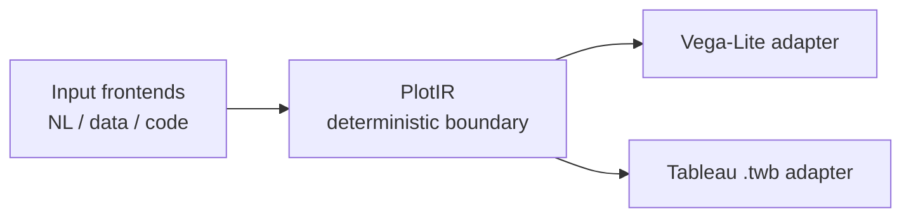

# PlotIR v0.1

PlotIR is a tool-neutral visualization IR that compiles one validated chart intent into Vega-Lite and Tableau `.twb` outputs.

> One Intent, Many Outputs

## Architecture



Every input must pass through `PlotSchema.parse()` before it reaches an adapter. `toVegaLite` and `toTableau` are pure functions over a validated `Plot`.

- L1 seam: the field registry preserves source column names, data types, dimension/measure roles, and default aggregates.
- L2 core: v0.1 represents one view with marks, encodings, filters, and sorting.
- L3 seam: workbook-level concepts remain future vision and are not implemented in v0.1.

## Repository Layout

```text
packages/
  core/       PlotIR types, Zod schema, and shared semantic helpers
  vegalite/   PlotIR to Vega-Lite adapter
  tableau/    PlotIR to Tableau .twb adapter
apps/
  web/        Next.js Playground
examples/     Validated PlotIR and CSV fixtures
docs/
  adr/        Public architecture decisions
  tableau-reverse-engineering/
lab/          Curated technical experiments only
```

## Repository Strategy

PlotIR follows a public-first development strategy.

Technical design, adapter implementation, examples, tests, ADRs, and Tableau reverse-engineering notes are developed in the public repository.

Private repositories are used only for competition strategy, presentation drafts, raw prompt experiments, and personal notes.

This keeps the engineering process transparent while separating non-technical or private materials from the open-source project.

The public repository is the default development space. Secrets, credentials, personal identifiers, private strategy, and uncurated notes must never be committed here.

## v0.1 Scope

- Mark: `bar | line | point | text`
- Aggregate: `sum | mean | count | min | max | median`
- Transform: `filter | sort`
- Channel: `x | y | color | size | text`
- Data source: one flat CSV

Joins, calculated fields, parameters, dashboards, actions, shared metrics, and Natural Language to PlotIR are outside v0.1.

## Quick Start

```bash
npm install
npm run build
npm test
npm run demo
npm run dev
```

`npm run demo` reads `examples/example.json`, validates it with `PlotSchema.parse()`, and creates:

- `dist/output.vega.json`
- `dist/output.twb`

The sample data is `examples/sales.csv`.

`npm run dev` starts the Playground at [http://localhost:3000](http://localhost:3000).

## Web Playground

The Next.js app visualizes this pipeline:

```text
CSV → PlotIR → Compiler → Vega-Lite → Rendered Chart
```

It displays the validated PlotIR JSON, the existing Vega-Lite adapter output, a `react-vega` chart, and download actions for Vega JSON and Tableau TWB. The UI does not reimplement adapter logic.

## Package Usage

```ts
import { PlotSchema } from "@plotir/core";
import { toVegaLite } from "@plotir/vegalite";
import { toTableau } from "@plotir/tableau";

const plot = PlotSchema.parse(input);
const vegaLite = toVegaLite(plot);
const tableauWorkbook = toTableau(plot);
```

## Tableau Validation

The generated Tableau XML includes the federated/textscan hierarchy, datasource dependencies, and pill-to-column-instance mappings covered by automated tests. Actual Tableau Desktop compatibility is not claimed without a Desktop-generated workbook diff.

See:

- [HARDENING.md](./HARDENING.md)
- [Tableau reverse-engineering notes](./docs/tableau-reverse-engineering/README.md)

## Future Vision

These are directions, not v0.1 features:

- Workbook IR
- Round-trip editing
- Additional visualization tool adapters
